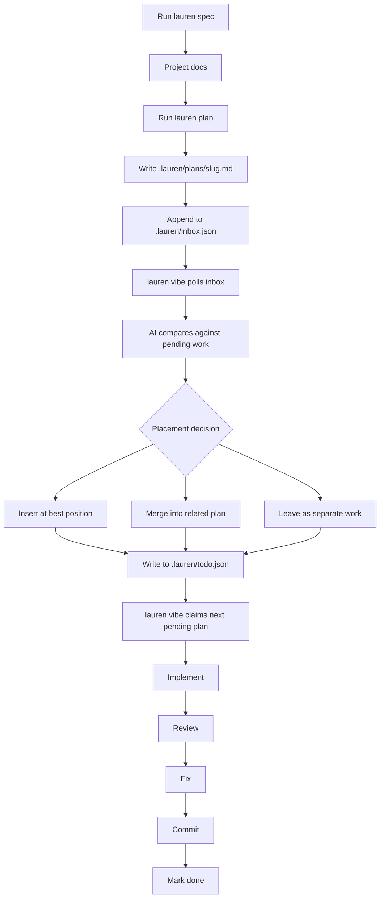
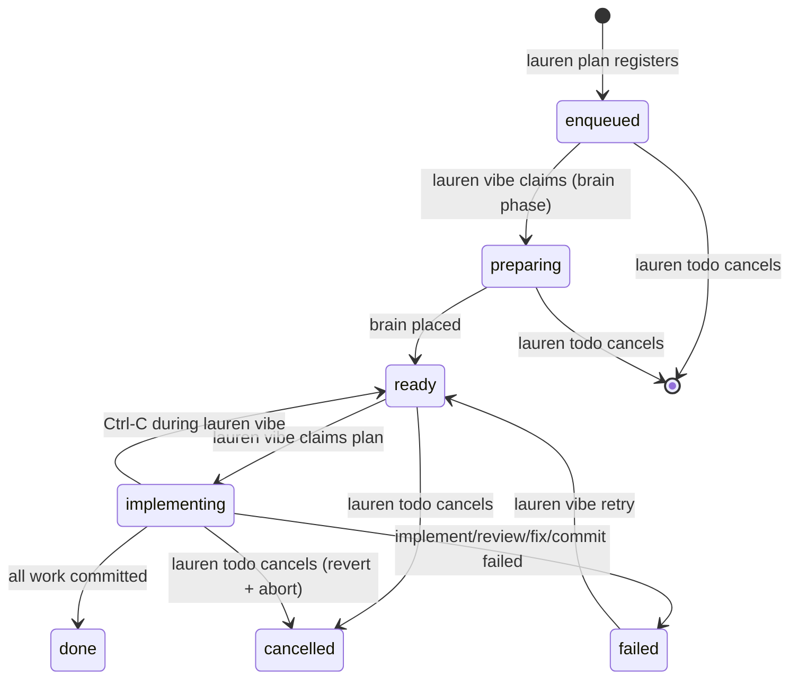
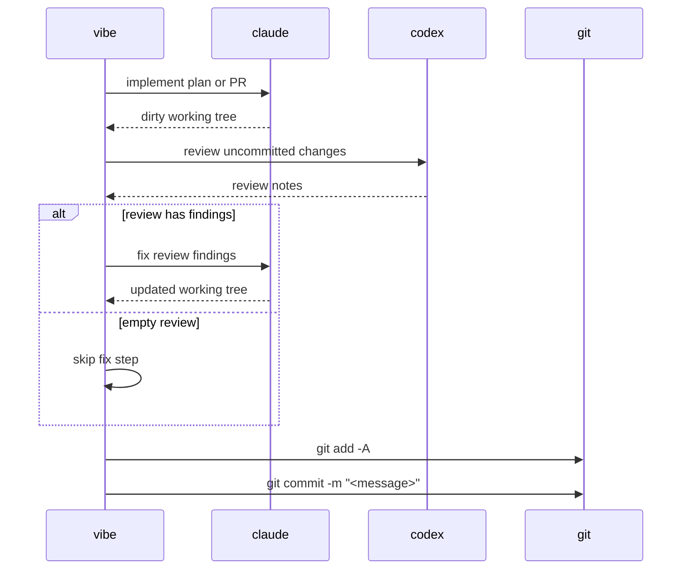

# Lauren

AI-managed implementation backlog for Git repositories.

Lauren turns approved plans into commits. You plan work with `lauren`; an AI
backlog manager then decides where that plan belongs. It can insert, reorder, or
merge related pending work instead of blindly appending another task to the end of
a list.

The pipeline is split across two processes you run in parallel:

```text
lauren plan -> .lauren/inbox.json -> lauren vibe -> .lauren/todo.json -> lauren vibe -> commits
                                     (AI placement)                          (claude/codex/git)
```

`lauren plan` only writes to the inbox and exits — planning sessions never
block on the AI. `lauren vibe` is the unified daemon: each loop iteration it
first drains the inbox (asking the AI where each plan belongs and dropping it
into the todo), then implements one ready plan end-to-end:

```text
claude implements -> codex reviews -> claude fixes -> git commits
```

## Requirements

- Node.js 20+
- Git
- `claude` on `$PATH`, authenticated and usable from the terminal
- `codex` on `$PATH`, authenticated and usable from the terminal
- A clean Git working tree before running `lauren vibe`

Lauren runs against the current Git repository. Run `lauren` from inside the
project you want to change, not from this repository.

## Install

From source:

```sh
git clone https://github.com/ofux/lauren.git
cd lauren
npm ci
npm run build
npm link
```

This exposes one command:

- `lauren`: planning, AI-managed queue operations, and queue execution

Check the install:

```sh
lauren --help
lauren vibe --help
```

## Quick Start

In the repository you want Lauren to modify, open two terminals:

```sh
# Terminal 1 — plan work
lauren spec
lauren plan "add password reset"

# Terminal 2 — unified daemon (AI placement + execution)
lauren vibe
```

`lauren spec` is optional. It asks Claude to create or refine:

- `docs/PRD.md`
- `docs/ARCHITECTURE.md`
- `docs/TESTING.md`

`lauren plan` starts an interactive Claude session. When you approve the plan,
it writes a Markdown plan under `.lauren/plans/` and queues it in
`.lauren/inbox.json`. The session exits immediately.

`lauren vibe` is the single long-running daemon. Each iteration it polls the
inbox every 3 seconds, asks the AI backlog manager where each new plan fits
against existing pending work, drops it into `.lauren/todo.json`, then claims
one ready plan and runs it through the implement/review/fix/commit pipeline.

This is the core feature: `.lauren/todo.json` is not a simple append-only todo
list. It is the persisted state of a backlog that Lauren continuously shapes.

For diagnostics you can preview the queue without running anything:

```sh
lauren plan "..."
lauren vibe --dry-run
```

## Workflow



Queue state:



## AI-Managed Backlog

Lauren does not treat plans as independent tickets pushed onto the end of a queue.
Every new plan is evaluated against the pending backlog.

When `lauren vibe`'s brain phase picks up a plan from the inbox, the AI can:

- insert it before or after existing pending work
- merge it into a related pending plan
- leave it as a standalone plan at the end of the queue

`lauren reorganize` runs the same AI pass across the whole pending todo as a
one-shot. Use it when the queue has drifted, when several plans overlap, or
when you want the next run to execute in a better order. It refuses to run if
`lauren vibe` is alive (the daemon owns the queue while running).

## Commands

### Plan and reorganize

```sh
lauren spec
```

Create or refine project docs under `docs/`.

```sh
lauren plan [seed_prompt]
```

Open an interactive planner. The planner creates `.lauren/plans/<slug>.md` and
appends an entry to `.lauren/inbox.json`. Brain placement happens
asynchronously — the session exits as soon as the plan is queued.

```sh
lauren reorganize
lauren reorganize --yes
lauren reorganize --dry-run
```

One-shot pass that asks the AI to reorganize the whole pending todo. It may
reorder plans or merge related plans. Without `--yes`, Lauren asks before
applying the proposed operations. `--dry-run` prints the proposed operations
without applying them. Refuses to run if `lauren vibe` is alive.

```sh
lauren todo
lauren todo --list
```

Open the interactive queue TUI showing the merged inbox + todo. Use ↑/↓ to
navigate, Enter (or `c`) to cancel the highlighted plan, and `q` to quit. The
cancellation behavior depends on the row's status — `enqueued` rows are
removed; `preparing` and `implementing` rows signal the vibe daemon to abort
the in-flight subprocess; `ready` rows are marked `cancelled` directly.
`--list` prints a static table without entering the TUI (also the default in
non-TTY contexts like CI).

### Execute

```sh
lauren vibe
```

Start the unified daemon. Each iteration it drains the inbox (placing each new
plan via brain) and runs one ready plan through the implement/review/fix/commit
pipeline.

```sh
lauren vibe --dry-run
```

Print what would run and exit.

```sh
lauren vibe retry <slug>
```

Move a `failed` or stale `implementing` plan back to `ready`.

To remove or stop a plan, open `lauren todo` and cancel the row. There is no
`lauren vibe rm` command — cancellation is the single, status-aware path that
correctly handles in-flight work (signaling the daemon, reverting partial
implementations, etc.).

## Plan Files

Plans live in `.lauren/plans/`.

Every plan starts with a YAML frontmatter block. The vibe daemon's brain phase
reads only this block to decide where to insert the plan or whether to merge
it into an existing one — the brain reaches for the full body only when
descriptions are not enough. `name` MUST equal the slug; `description` is a
3–4 line `|` block scalar covering what the plan does, why, and what
files/areas it touches. `lauren _register` rejects plans whose frontmatter is
missing or whose `name` does not match the slug.

A normal plan is one execution unit and produces one commit:

```md
---
name: add-password-reset
description: |
  Adds password reset flow with token model, email-based reset
  endpoint, and reset form UI.
  Touches src/auth/, src/email/, src/components/auth/.
---

# Add password reset

...
```

A multi-PR plan keeps the same frontmatter and is split into separate commits
by headings that match this exact format:

```md
---
name: password-reset-suite
description: |
  Ships password reset across three commits: token model,
  request endpoint, and the reset form UI.
  Touches src/auth/, src/email/, src/components/auth/.
---

### PR 1.1 — Add reset token model

### PR 1.2 — Add reset request endpoint

### PR 1.3 — Add reset form
```

Each PR section runs through the full pipeline and gets its own commit.

## Execution Pipeline



Commit messages:

- Single-unit plan: `<slug>: Plan — <title>`
- Multi-PR plan: `<slug>: PR X.Y — <title>`

Multi-PR resume uses Git history. If a plan fails after some PRs were committed,
`lauren vibe retry <slug>` skips PR IDs that already have matching commit subjects.

## Files Written in Target Repos

Lauren writes project-local state under the target repository:

```text
.lauren/
  plans/           Markdown plans
  logs/<slug>/     implement/review/fix logs
  inbox.json       enqueued / preparing plans (waiting for brain placement)
  inbox.json.lock  inbox mutation lock
  todo.json        ready / implementing / done / failed / cancelled plans
  todo.json.lock   todo mutation lock
  vibe.lock        vibe daemon lock
  vibe.pid         vibe PID (used by lauren todo to send SIGUSR2)
docs/
  PRD.md
  ARCHITECTURE.md
  TESTING.md
```

## Operating Rules

- Start `lauren vibe` only with a clean working tree.
- Run only one `lauren vibe` daemon per repository.
- `lauren reorganize` refuses to run while `lauren vibe` is alive — stop the
  daemon first if you want to reshape the queue.
- A failed plan pauses the implement loop until you retry or cancel it. The
  brain phase keeps draining the inbox while paused.
- `implementing` plans are locked against normal queue mutations.
- Stopping `lauren vibe` with Ctrl-C is safe: an active implement is demoted
  back to `ready`, and partially-placed `preparing` rows are reset to
  `enqueued` on the next start.
- Logs are written under `.lauren/logs/<slug>/`.

## Development

```sh
npm run build
npm run watch
npm run check
npm run lint
npm run format
npm test
```

Before opening a PR:

```sh
npm run build
npm run check
npm test
```

Source layout:

```text
src/bin/        CLI entry point
src/core/       paths, todo & inbox stores, types, slug/time helpers
src/proc/       claude, codex, git, and subprocess wrappers
src/tui/        Ink UI for vibe
src/executor.ts plan execution pipeline
src/brain.ts    AI queue placement and organization
src/vibe-command.ts vibe daemon bootstrap
src/watcher.ts  unified vibe loop (inbox-drain + implement) and process lock helpers
src/organize.ts brain-driven inbox draining (processInboxPlan)
```

## License

GPL-3.0
