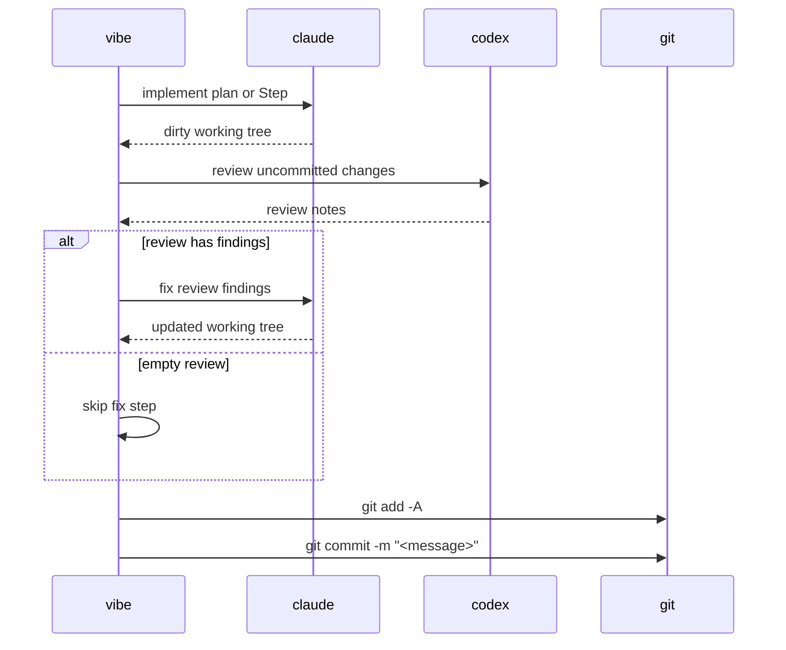

# Lauren

A Ralph-inspired autonomous AI agent loop that keeps working through your project while you keep planning what comes next.

Ralph is powerful because it is simple: it takes a fixed TODO list, loops over each task, and asks an agent like Claude or Amp to implement it in a fresh context. Lauren keeps that core idea, but makes the TODO list dynamic.

The problem Lauren solves is simple: while an agent is working, you often think of the next five things you want done. But those ideas do not always belong at the end of the queue. Some should be merged with pending tasks, some should replace earlier plans, and some may contradict work that has not started yet.

Lauren lets you keep planning naturally.

Trigger `/lauren` from Claude Code to describe what you want next. The Lauren daemon, started with `lauren vibe`, asks Claude Code to integrate your request into the project TODO list. It decides whether to append, merge, refine, or replace pending tasks.

Once running, Lauren keeps looping through the TODO list and, for each task:

- create an isolated git worktree;
- ask Claude to implement the task;
- ask Codex to review the result;
- ask Claude to fix issues from the review;
- merge the work automatically, or open a PR depending on your configuration.

In other words, Lauren is a never-ending Ralph-style loop with a live, editable plan. You keep deciding what should happen next; Lauren keeps turning the plan into code.


## Requirements

- Node.js 20+
- Git
- `claude` on `$PATH`, authenticated and usable from the terminal
- `codex` on `$PATH`, authenticated and usable from the terminal
- A clean Git working tree before running `lauren vibe`

Lauren runs against the current Git repository (or a parent folder containing
one or more git sub-repositories — see [Multi-Repo Workspaces](#multi-repo-workspaces)).
Run `lauren` from inside the project you want to change, not from this repository.

## Install

From source:

```sh
git clone https://github.com/ofux/lauren.git
cd lauren
npm ci
npm run build
npm link
```

This exposes one command:

- `lauren`: planning, AI-managed queue operations, and queue execution

Check the install:

```sh
lauren --help
lauren vibe --help
```

## Quick Start

### Add specs (optional - recommended if you're starting a new project)

```sh
lauren spec
```

This will help you create a solid (but simple) initial spec for your project.  It asks Claude to create or refine:

- `docs/PRD.md`
- `docs/ARCHITECTURE.md`
- `docs/TESTING.md`

### Start working

In the repository you want Lauren to modify, initialize Lauren to install required SKILLs:

```sh
lauren init --global
```

Then, start the deamon:

```sh
lauren vibe
```

Then, in claude, just type `/lauren` and describe what you want.

If you've been discussing with claude about something and realize afterwise that you want to turn this into a lauren's plan, just say so (e.g. "Add what we've just discussed about to lauren").

Behind. the scene, they will both use the Lauren SKILL to create a proper plan (in the format expected by Lauren) and register it to the todo list.

**Important: dirty state will prevent Lauren from being able to auto-merge on your main branch. I strongly recommend you to use git worktrees if you want to work in parallel of Lauren.**

## AI-Managed Backlog

Lauren does not treat plans as independent tickets pushed onto the end of a queue.
Every new plan is evaluated against the pending backlog.

When `lauren vibe`'s brain phase picks up an `enqueued` plan, the AI can:

- insert it before or after existing pending work
- merge it into a related pending plan
- leave it as a standalone plan at the end of the queue

Pressing `r` in the `lauren` TUI runs the same AI pass across the whole pending
todo as a one-shot. Use it when the queue has drifted, when several plans
overlap, or when you want the next run to execute in a better order. It is
disabled while `lauren vibe` is alive (the daemon owns the queue while running).

## Commands

### Plan and inspect the queue

```sh
lauren spec
```

Create or refine project docs under `docs/`.

```sh
lauren plan [seed_prompt]
```

Open an interactive planner. The planner creates `.lauren/plans/<slug>.md` and
appends an `enqueued` row to `.lauren/plans.json`. Brain placement happens
asynchronously — the session exits as soon as the plan is queued. If
`.lauren/workspace.json` exists, the planner passes one `--repo` flag per repo
the plan is allowed to touch; omit them to target every configured repo.

```sh
lauren
lauren --list
```

Open the interactive queue TUI showing every plan in `.lauren/plans.json`. Use
↑/↓ to navigate, Enter (or `c`) to cancel the highlighted plan, `t` to reset a
`failed` plan back to `ready`, `r` to run an AI reorganize pass over the ready
queue (disabled while `lauren vibe` is running), and `q` to quit. The
cancellation behavior depends on the row's status — `enqueued` rows are
removed; `preparing` and `implementing` rows signal the vibe daemon to abort
the in-flight subprocess; `ready` rows are marked `cancelled` directly.
`--list` prints a static table without entering the TUI (also the default in
non-TTY contexts like CI).

### Execute

```sh
lauren vibe
```

Start the unified daemon. Each iteration it drains every `enqueued` plan and runs one ready plan through the
implement/review/fix/commit pipeline. If the implement step exits cleanly
with no diff, Lauren assumes the work was already done — review, fix, and
commit are skipped and the plan (or Step) is marked done with no commit.

## Plan Files

Plans live in `.lauren/plans/`.

Every plan starts with a YAML frontmatter block. The vibe daemon's brain phase
reads only this block to decide where to insert the plan or whether to merge
it into an existing one — the brain reaches for the full body only when
descriptions are not enough. `name` MUST equal the slug; `description` is a
3–4 line `|` block scalar covering what the plan does, why, and what
files/areas it touches. `lauren _register` rejects plans whose frontmatter is
missing or whose `name` does not match the slug.

A normal plan is one execution unit and produces one commit:

```md
---
name: add-password-reset
description: |
  Adds password reset flow with token model, email-based reset
  endpoint, and reset form UI.
  Touches src/auth/, src/email/, src/components/auth/.
---

# Add password reset

...
```

A multi-step plan keeps the same frontmatter and is split into separate commits
by headings that match this exact format:

```md
---
name: password-reset-suite
description: |
  Ships password reset across three commits: token model,
  request endpoint, and the reset form UI.
  Touches src/auth/, src/email/, src/components/auth/.
---

### Step 1.1 — Add reset token model

### Step 1.2 — Add reset request endpoint

### Step 1.3 — Add reset form
```

Each Step section runs through the full pipeline and gets its own commit.

## Execution Pipeline



Commit messages:

- Single-unit plan: `<slug>: Plan — <title>`
- Multi-step plan: `<slug>: Step X.Y — <title>`

For multi-repo workspaces, every dirty target repo gets its own commit with
the same subject. Peer repos with no changes are not given empty marker
commits.

Multi-step resume reads per-Step state stored on the plan row in
`.lauren/plans.json` (`plans[].steps`). When `lauren vibe` claims a plan it
re-parses the markdown and reconciles against that list — Step IDs already
marked `done` are skipped, only `pending` or `failed` Steps are run. Git history
is not consulted for resume. Steps you edited out of the markdown after a
partial run are kept as `orphaned` so they're visible but never re-executed.
