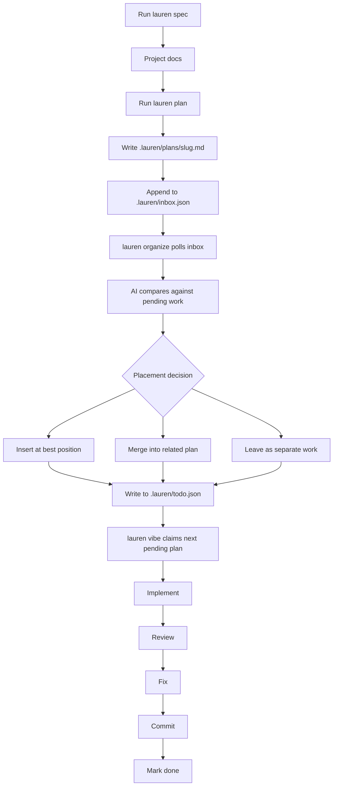
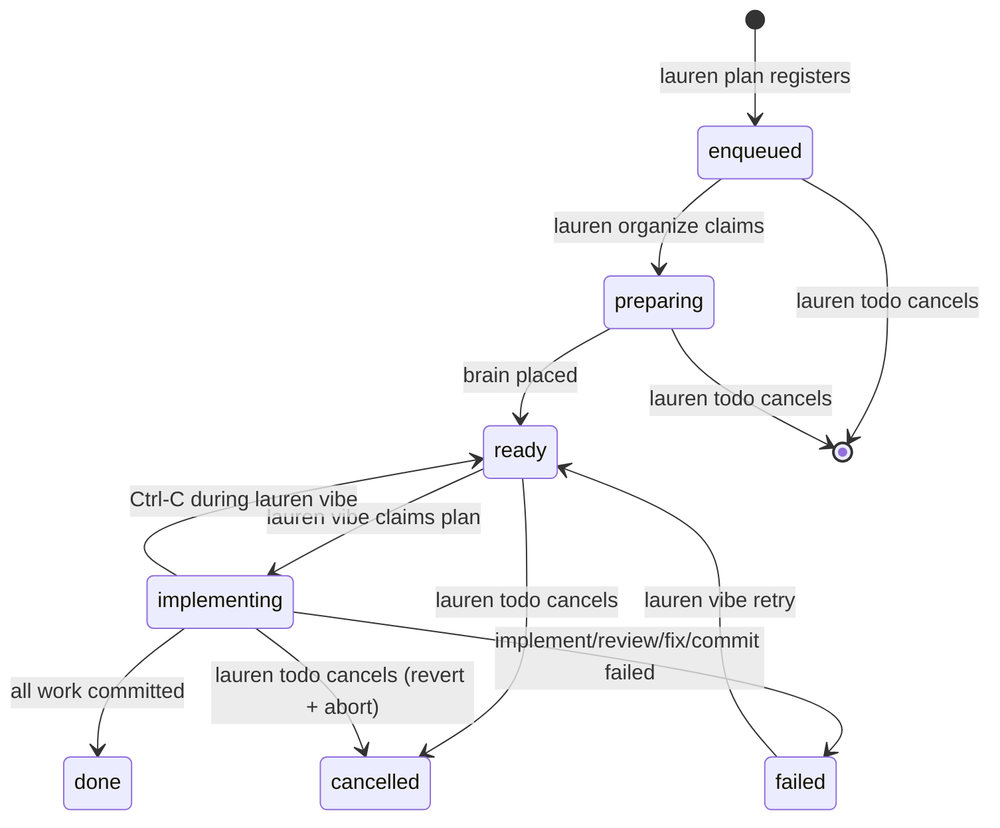
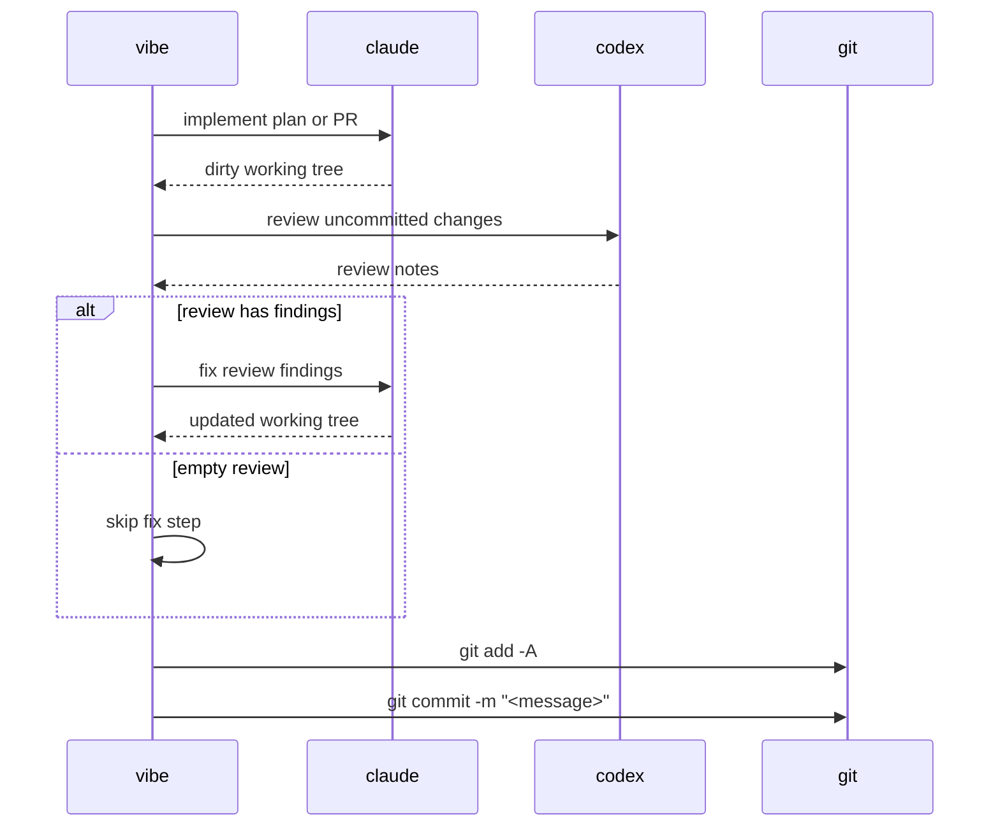

# Lauren

AI-managed implementation backlog for Git repositories.

Lauren turns approved plans into commits. You plan work with `lauren`; an AI
backlog manager then decides where that plan belongs. It can insert, reorder, or
merge related pending work instead of blindly appending another task to the end of
a list.

The pipeline is split across three independent processes you run in parallel:

```text
lauren plan -> .lauren/inbox.json -> lauren organize -> .lauren/todo.json -> lauren vibe -> commits
                                     (AI placement)                                 (claude/codex/git)
```

`lauren plan` only writes to the inbox and exits — planning sessions never
block on the AI. `lauren organize` is the long-running daemon that polls the
inbox, asks the AI where each plan belongs, and drops it into the todo.
`lauren vibe` drains the todo end-to-end:

```text
claude implements -> codex reviews -> claude fixes -> git commits
```

## Requirements

- Node.js 20+
- Git
- `claude` on `$PATH`, authenticated and usable from the terminal
- `codex` on `$PATH`, authenticated and usable from the terminal
- A clean Git working tree before running `lauren vibe`

Lauren runs against the current Git repository. Run `lauren` from inside the
project you want to change, not from this repository.

## Install

From source:

```sh
git clone https://github.com/ofux/lauren.git
cd lauren
npm ci
npm run build
npm link
```

This exposes one command:

- `lauren`: planning, AI-managed queue operations, and queue execution

Check the install:

```sh
lauren --help
lauren vibe --help
```

## Quick Start

In the repository you want Lauren to modify, open three terminals:

```sh
# Terminal 1 — plan work
lauren spec
lauren plan "add password reset"

# Terminal 2 — AI placement daemon
lauren organize

# Terminal 3 — execution daemon
lauren vibe
```

`lauren spec` is optional. It asks Claude to create or refine:

- `docs/PRD.md`
- `docs/ARCHITECTURE.md`
- `docs/TESTING.md`

`lauren plan` starts an interactive Claude session. When you approve the plan,
it writes a Markdown plan under `.lauren/plans/` and queues it in
`.lauren/inbox.json`. The session exits immediately.

`lauren organize` is a long-running daemon that polls the inbox every 3 seconds.
For each new plan it asks the AI backlog manager how the plan should fit with
existing pending work, applies that decision against `.lauren/todo.json`, and
drops the plan from the inbox.

`lauren vibe` is the execution watcher. It polls `.lauren/todo.json` and runs
one plan at a time through the implement/review/fix/commit pipeline.

This is the core feature: `.lauren/todo.json` is not a simple append-only todo
list. It is the persisted state of a backlog that Lauren continuously shapes.

For ad-hoc use you can drain the inbox once and stop:

```sh
lauren plan "..."
lauren organize --once
lauren vibe --dry-run
```

## Workflow



Queue state:



## AI-Managed Backlog

Lauren does not treat plans as independent tickets pushed onto the end of a queue.
Every new plan is evaluated against the pending backlog.

When `lauren organize` picks up a plan from the inbox, the AI can:

- insert it before or after existing pending work
- merge it into a related pending plan
- leave it as a standalone plan at the end of the queue

`lauren organize --all` runs the same AI pass across the whole pending todo. Use it
when the queue has drifted, when several plans overlap, or when you want the next
run to execute in a better order.

`lauren vibe` does not make planning decisions. It only drains the ordered
backlog that `lauren organize` has shaped.

## Commands

### Plan and organize

```sh
lauren spec
```

Create or refine project docs under `docs/`.

```sh
lauren plan [seed_prompt]
```

Open an interactive planner. The planner creates `.lauren/plans/<slug>.md` and
appends an entry to `.lauren/inbox.json`. Brain placement happens
asynchronously — the session exits as soon as the plan is queued.

```sh
lauren organize
lauren organize --once
lauren organize --dry-run
```

Long-running daemon that drains `.lauren/inbox.json` into `.lauren/todo.json`.
For each inbox plan it asks the AI where it belongs and applies the decision
against the todo. `--once` exits when the inbox is empty. `--dry-run` prints
what brain would decide without mutating either file. Only one daemon may run
per repository (enforced via `.lauren/brain.lock`).

```sh
lauren organize --all
lauren organize --all --yes
lauren organize --all --dry-run
```

One-shot pass that asks the AI to reorganize the whole pending todo. It may
reorder plans or merge related plans. Without `--yes`, Lauren asks before
applying the proposed operations. `--dry-run` prints the proposed operations
without applying them.

```sh
lauren todo
lauren todo --list
```

Open the interactive queue TUI showing the merged inbox + todo. Use ↑/↓ to
navigate, Enter (or `c`) to cancel the highlighted plan, and `q` to quit. The
cancellation behavior depends on the row's status — `enqueued` rows are
removed; `preparing` and `implementing` rows signal the brain or vibe daemon
respectively to abort the in-flight subprocess; `ready` rows are marked
`cancelled` directly. `--list` prints a static table without entering the TUI
(also the default in non-TTY contexts like CI).

### Execute

```sh
lauren vibe
```

Start the watcher. It polls the queue every 3 seconds and runs one plan at a time.

```sh
lauren vibe --dry-run
```

Print what would run and exit.

```sh
lauren vibe retry <slug>
```

Move a `failed` or stale `implementing` plan back to `ready`.

To remove or stop a plan, open `lauren todo` and cancel the row. There is no
`lauren vibe rm` command — cancellation is the single, status-aware path that
correctly handles in-flight work (signaling the daemons, reverting partial
implementations, etc.).

## Plan Files

Plans live in `.lauren/plans/`.

A normal plan is one execution unit and produces one commit:

```md
# Add password reset

...
```

A multi-PR plan is split into separate commits by headings that match this exact
format:

```md
### PR 1.1 — Add reset token model

### PR 1.2 — Add reset request endpoint

### PR 1.3 — Add reset form
```

Each PR section runs through the full pipeline and gets its own commit.

## Execution Pipeline



Commit messages:

- Single-unit plan: `<slug>: Plan — <title>`
- Multi-PR plan: `<slug>: PR X.Y — <title>`

Multi-PR resume uses Git history. If a plan fails after some PRs were committed,
`lauren vibe retry <slug>` skips PR IDs that already have matching commit subjects.

## Files Written in Target Repos

Lauren writes project-local state under the target repository:

```text
.lauren/
  plans/           Markdown plans
  logs/<slug>/     implement/review/fix logs
  inbox.json       enqueued / preparing plans (waiting for brain placement)
  inbox.json.lock  inbox mutation lock
  todo.json        ready / implementing / done / failed / cancelled plans
  todo.json.lock   todo mutation lock
  brain.lock       lauren organize daemon lock
  brain.pid        lauren organize PID (used by lauren todo to send SIGUSR2)
  vibe.lock        vibe watcher lock
  vibe.pid         vibe PID (used by lauren todo to send SIGUSR2)
docs/
  PRD.md
  ARCHITECTURE.md
  TESTING.md
```

## Operating Rules

- Start `lauren vibe` only with a clean working tree.
- Run only one `lauren vibe` watcher per repository.
- Run only one `lauren organize` daemon per repository.
- `lauren organize` and `lauren vibe` can run concurrently — they touch different files.
- A failed plan pauses the `lauren vibe` queue until you retry or remove it.
- `in_progress` plans are locked against normal queue mutations.
- Stopping `lauren vibe` with Ctrl-C demotes the active plan back to `pending`.
- Stopping `lauren organize` with Ctrl-C is safe at any point — placement is
  retried idempotently on next start.
- Logs are written under `.lauren/logs/<slug>/`.

## Development

```sh
npm run build
npm run watch
npm run check
npm run lint
npm run format
npm test
```

Before opening a PR:

```sh
npm run build
npm run check
npm test
```

Source layout:

```text
src/bin/        CLI entry point
src/core/       paths, todo & inbox stores, types, slug/time helpers
src/proc/       claude, codex, git, and subprocess wrappers
src/tui/        Ink UI for vibe
src/executor.ts plan execution pipeline
src/brain.ts    AI queue placement and organization
src/vibe-command.ts executor subcommand
src/watcher.ts  vibe loop and process lock helpers
```

## License

GPL-3.0
