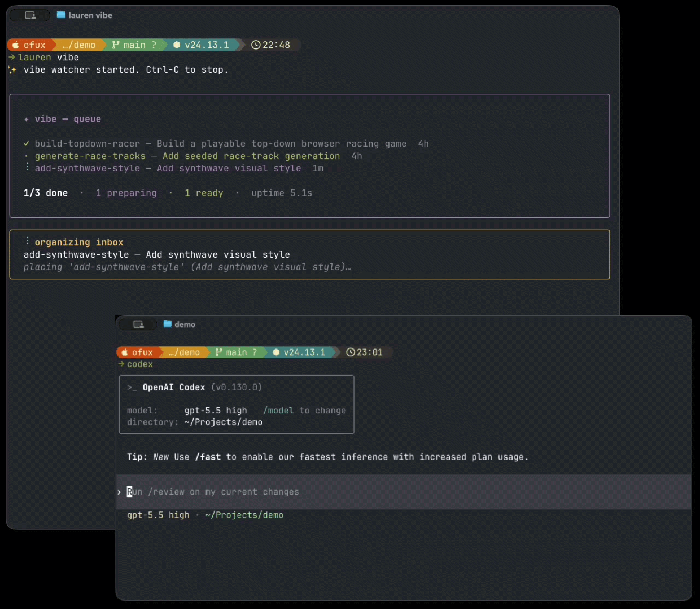

# Lauren

**Lauren is a live task queue for coding agents.**

Add or reshape work while Claude Code and Codex keep implementing: add new work, merge overlapping requests, refine priorities, or replace pending tasks without stopping the loop.

```sh
npm install -g @ofux/lauren
```



Lauren is inspired by [Ralph](https://github.com/snarktank/ralph), but built for projects that keep changing after the loop has started.

## Why Lauren?

| Ralph-style loop | Lauren |
| --- | --- |
| Drains a fixed task list | Keeps the task list editable while work is running |
| Best for "finish this" | Best for "keep building while I keep steering" |
| One loop around one body of work | A queue that can absorb new ideas as they appear |
| Usually one agent path | Route implement, review, fix, merge, and queue decisions independently to Claude or Codex |

## How it works

Trigger `/lauren` from Claude Code (or just type something like *"Use lauren to build ..."*) to describe what you want next. The Lauren daemon, started with `lauren vibe`, asks an agent to integrate your request into the project TODO list. It decides whether to append, merge, refine, or replace pending tasks.

Once running, Lauren keeps looping through the TODO list and, for each task:

- create an isolated git worktree;
- ask the configured agent to implement the task (defaults to Claude);
- ask the configured agent to review the result (defaults to Codex);
- ask the configured agent to fix issues from the review (defaults to Claude);
- merge the work automatically, or open a PR depending on your configuration.

Each pipeline phase (and the merger conflict-resolver and brain placement
calls) can be routed to either `claude` or `codex` independently — see
the `agents` block in [Configuration](#configuration).

### Implementation notes

(Idea credit: [@trq212](https://x.com/trq212/status/2056415973125796184?s=20).)

While implementing (and addressing review feedback), the agent keeps a
running HTML file at `.lauren/notes/<slug>.notes.html` capturing the
decisions it had to make that weren't in the spec, anything it changed
from what the spec said, tradeoffs, and other things you should know.

In the `lauren` TUI, plans that have notes show a `· notes` marker next
to the row; press `n` to open the file in your browser.

Notes generation is on by default. To turn it off, set
`"notes_enabled": false` in `.lauren/config.json`.

## Requirements

- A clean Git working tree before running `lauren vibe`

At least one of:

- `claude` on `$PATH`, authenticated and usable from the terminal
- `codex` on `$PATH`, authenticated and usable from the terminal

Lauren runs against the current Git repository (or a parent folder containing
one or more git sub-repositories).
Run `lauren` from inside the project you want to change, not from the lauren install directory.

## Install

```sh
npm install -g @ofux/lauren
```

From source:

```sh
git clone https://github.com/ofux/lauren.git
cd lauren
npm ci
npm run build
npm link
```

Check the install:

```sh
lauren --help
lauren vibe --help
```

## Quick Start

### Optional: add some specs (recommended if you're starting a new project)

```sh
lauren spec
```

This will help you create a solid (but simple) initial spec for your project.

### Init

In the repository you want Lauren to modify, initialize Lauren to install the required skills (and Claude Code `/lauren` slash command):

```sh
lauren init
```

This installs both the Claude Code skill + `/lauren` slash command (under `.claude/`) and the Codex skill (under `.agents/skills/lauren/SKILL.md`). Add `--global` to install to `~/.claude/` and `~/.agents/` instead. To install only one side, use `lauren init claude` or `lauren init codex`.

### Start the daemon

Start the daemon in another terminal:

```sh
lauren vibe
```

### Start working

Then, in Claude Code, just type `/lauren` and describe what you want. In Codex, just type something like "Let's use lauren to build ..." in order to use the skill.

If you've been discussing with your agent about something and realize afterwards that you want to turn this into a lauren plan, just say so (e.g. "Add what we've just discussed about to lauren").

Behind the scenes, they will use the Lauren SKILL to create a proper plan (in the format expected by Lauren) and register it to the todo list.

**Important: dirty state might prevent Lauren from being able to auto-merge on your main branch. I strongly recommend you to use git worktrees if you want to work in parallel of Lauren.**

### How to cancel a task

You can see the current state of the TODO-list with:

```sh
lauren
```

This will open a simple TUI showing what's in the queue, and will allow you to cancel some tasks.

## Configuration

Settings live in `.lauren/config.json` in your project. All fields are optional;
missing fields fall back to the defaults shown below:

```json
{
  "version": 1,
  "dev_branch": "main",
  "merge_mode": "auto",
  "notes_enabled": true,
  "agents": {
    "implement": "claude",
    "review": "codex",
    "fix": "claude",
    "merger": "claude",
    "brain": "claude"
  }
}
```

Each `agents` role accepts `"claude"` or `"codex"` and can be configured
independently. The three pipeline phases (`implement`, `review`, `fix`) cover
the per-plan run; `merger` is invoked only when an auto-merge hits conflicts;
`brain` runs the JSON placement / reorganize decisions over the queue.
