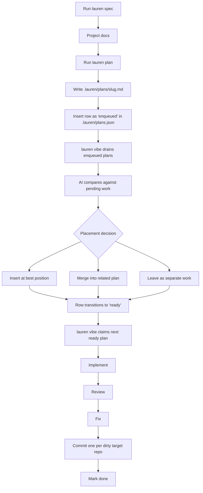
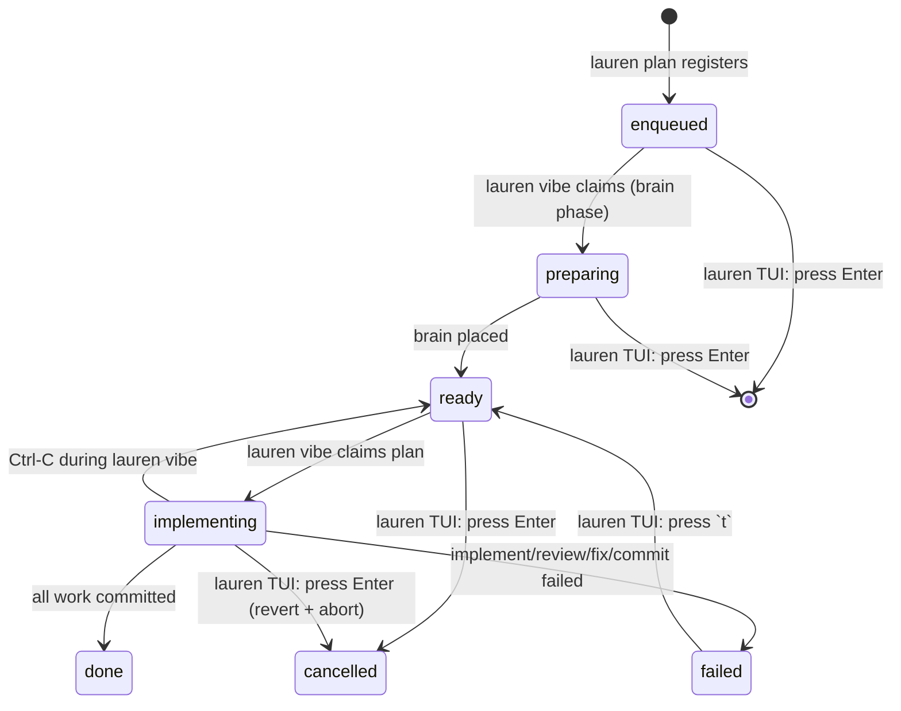
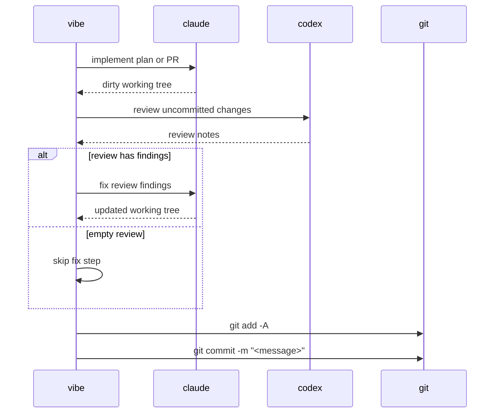

# Lauren

AI-managed implementation backlog for Git repositories.

Lauren turns approved plans into commits. You plan work with `lauren`; an AI
backlog manager then decides where that plan belongs. It can insert, reorder, or
merge related pending work instead of blindly appending another task to the end of
a list.

The pipeline is split across two processes you run in parallel:

```text
lauren plan ──► .lauren/plans.json ──► lauren vibe ──► commits
              (enqueued)   (ready)      (AI placement +
                                         claude/codex/git)
```

`lauren plan` only enqueues the plan and exits — planning sessions never
block on the AI. `lauren vibe` is the unified daemon: each loop iteration it
first drains every `enqueued` plan (asking the AI where each one belongs in
the ready queue), then implements one ready plan end-to-end:

```text
claude implements -> codex reviews -> claude fixes -> git commits
```

Multi-repo workspaces are supported: from a parent directory containing several
git repos, or via an explicit `.lauren/workspace.json`, a single plan can touch
multiple repos and Lauren creates one commit per dirty repo with a shared
subject (see [Multi-Repo Workspaces](#multi-repo-workspaces)).

## Requirements

- Node.js 20+
- Git
- `claude` on `$PATH`, authenticated and usable from the terminal
- `codex` on `$PATH`, authenticated and usable from the terminal
- A clean Git working tree before running `lauren vibe`

Lauren runs against the current Git repository (or a parent folder containing
one or more git sub-repositories — see [Multi-Repo Workspaces](#multi-repo-workspaces)).
Run `lauren` from inside the project you want to change, not from this repository.

## Install

From source:

```sh
git clone https://github.com/ofux/lauren.git
cd lauren
npm ci
npm run build
npm link
```

This exposes one command:

- `lauren`: planning, AI-managed queue operations, and queue execution

Check the install:

```sh
lauren --help
lauren vibe --help
```

## Quick Start

In the repository you want Lauren to modify, open two terminals:

```sh
# Terminal 1 — plan work
lauren spec
lauren plan "add password reset"

# Terminal 2 — unified daemon (AI placement + execution)
lauren vibe
```

`lauren spec` is optional. It asks Claude to create or refine:

- `docs/PRD.md`
- `docs/ARCHITECTURE.md`
- `docs/TESTING.md`

`lauren plan` starts an interactive Claude session. When you approve the plan,
it writes a Markdown plan under `.lauren/plans/` and queues it as `enqueued`
in `.lauren/plans.json`. The session exits immediately.

`lauren vibe` is the single long-running daemon. Each iteration it polls the
queue every 3 seconds, asks the AI backlog manager where each new plan fits
against existing pending work (transitioning the row through `preparing` to
`ready`), then claims one ready plan and runs it through the
implement/review/fix/commit pipeline.

This is the core feature: `.lauren/plans.json` is not a simple append-only todo
list. It is the persisted state of a backlog that Lauren continuously shapes.

For diagnostics you can preview the queue without running anything:

```sh
lauren plan "..."
lauren vibe --dry-run
```

## Workflow



Queue state:



## AI-Managed Backlog

Lauren does not treat plans as independent tickets pushed onto the end of a queue.
Every new plan is evaluated against the pending backlog.

When `lauren vibe`'s brain phase picks up an `enqueued` plan, the AI can:

- insert it before or after existing pending work
- merge it into a related pending plan
- leave it as a standalone plan at the end of the queue

Pressing `r` in the `lauren` TUI runs the same AI pass across the whole pending
todo as a one-shot. Use it when the queue has drifted, when several plans
overlap, or when you want the next run to execute in a better order. It is
disabled while `lauren vibe` is alive (the daemon owns the queue while running).

## Commands

### Plan and inspect the queue

```sh
lauren spec
```

Create or refine project docs under `docs/`.

```sh
lauren plan [seed_prompt]
```

Open an interactive planner. The planner creates `.lauren/plans/<slug>.md` and
appends an `enqueued` row to `.lauren/plans.json`. Brain placement happens
asynchronously — the session exits as soon as the plan is queued. If
`.lauren/workspace.json` exists, the planner passes one `--repo` flag per repo
the plan is allowed to touch; omit them to target every configured repo.

```sh
lauren
lauren --list
```

Open the interactive queue TUI showing every plan in `.lauren/plans.json`. Use
↑/↓ to navigate, Enter (or `c`) to cancel the highlighted plan, `t` to reset a
`failed` plan back to `ready`, `r` to run an AI reorganize pass over the ready
queue (disabled while `lauren vibe` is running), and `q` to quit. The
cancellation behavior depends on the row's status — `enqueued` rows are
removed; `preparing` and `implementing` rows signal the vibe daemon to abort
the in-flight subprocess; `ready` rows are marked `cancelled` directly.
`--list` prints a static table without entering the TUI (also the default in
non-TTY contexts like CI).

### Execute

```sh
lauren vibe
```

Start the unified daemon. Each iteration it drains every `enqueued` plan
(placing each one via brain) and runs one ready plan through the
implement/review/fix/commit pipeline. If the implement step exits cleanly
with no diff, Lauren assumes the work was already done — review, fix, and
commit are skipped and the plan (or PR) is marked done with no commit.

```sh
lauren vibe --dry-run
```

Print what would run and exit.

To retry a `failed` plan, open `lauren` and press `t` on it. To remove or stop
a plan, open `lauren` and cancel the row. There is no `lauren vibe rm`
command — cancellation is the single, status-aware path that correctly handles
in-flight work (signaling the daemon, reverting partial implementations, etc.).
Stale `implementing` rows from a crashed prior run must be recovered manually:
clean the working tree, then edit `.lauren/plans.json` to set `status: "ready"`
(clearing `started_at` and `failure`) before restarting `lauren vibe`.

## Plan Files

Plans live in `.lauren/plans/`.

Every plan starts with a YAML frontmatter block. The vibe daemon's brain phase
reads only this block to decide where to insert the plan or whether to merge
it into an existing one — the brain reaches for the full body only when
descriptions are not enough. `name` MUST equal the slug; `description` is a
3–4 line `|` block scalar covering what the plan does, why, and what
files/areas it touches. `lauren _register` rejects plans whose frontmatter is
missing or whose `name` does not match the slug.

A normal plan is one execution unit and produces one commit:

```md
---
name: add-password-reset
description: |
  Adds password reset flow with token model, email-based reset
  endpoint, and reset form UI.
  Touches src/auth/, src/email/, src/components/auth/.
---

# Add password reset

...
```

A multi-PR plan keeps the same frontmatter and is split into separate commits
by headings that match this exact format:

```md
---
name: password-reset-suite
description: |
  Ships password reset across three commits: token model,
  request endpoint, and the reset form UI.
  Touches src/auth/, src/email/, src/components/auth/.
---

### PR 1.1 — Add reset token model

### PR 1.2 — Add reset request endpoint

### PR 1.3 — Add reset form
```

Each PR section runs through the full pipeline and gets its own commit.

## Execution Pipeline



Commit messages:

- Single-unit plan: `<slug>: Plan — <title>`
- Multi-PR plan: `<slug>: PR X.Y — <title>`

For multi-repo workspaces, every dirty target repo gets its own commit with
the same subject. Peer repos with no changes are not given empty marker
commits.

Multi-PR resume reads per-PR state stored on the plan row in
`.lauren/plans.json` (`plans[].prs`). When `lauren vibe` claims a plan it
re-parses the markdown and reconciles against that list — PR IDs already
marked `done` are skipped, only `pending` or `failed` PRs are run. Git history
is not consulted for resume. PRs you edited out of the markdown after a
partial run are kept as `orphaned` so they're visible but never re-executed.

## Multi-Repo Workspaces

Lauren can drive a single plan across multiple sibling git repositories.

If `.lauren/workspace.json` exists, it lists the repos Lauren is allowed to
touch:

```json
{
  "version": 1,
  "repos": [
    { "name": "frontend", "path": "frontend" },
    { "name": "backend",  "path": "backend"  }
  ]
}
```

Repo paths must stay inside the workspace root. Without a workspace.json,
Lauren auto-detects: if the working directory is itself a git repo, that's the
single target; otherwise, immediate sub-directories that contain a `.git`
entry are discovered as repos automatically.

The plan row records its `target_repos` (the repo names the plan is allowed to
modify, or `[]` meaning "every configured repo"). At execution time:

- All target repos must have a clean working tree before `lauren vibe` starts
  (and before each plan starts).
- The implement and fix steps run from the workspace root with full access to
  every target repo.
- The commit step iterates over the target repos, committing each dirty repo
  with the same subject.
- If a commit fails in the second-or-later repo of a multi-repo plan, Lauren
  pauses with an error that quotes the exact commit subject. Fix the issue,
  commit the remaining repos manually with that subject, then open `lauren`
  and press `t` on the failed row to retry.

## Files Written in Target Repos

Lauren writes project-local state under the workspace root:

```text
.lauren/
  plans/             Markdown plans
  logs/<slug>/       implement/review/fix logs (with per-PR sub-dirs)
  plans.json         the whole queue (every plan, every status)
  plans.json.lock    queue mutation lock
  workspace.json     (optional) multi-repo configuration
  vibe.lock          vibe daemon single-process lock
  vibe.pid           vibe PID (used by the lauren TUI to send SIGUSR2)
docs/
  PRD.md
  ARCHITECTURE.md
  TESTING.md
```

## Operating Rules

- Start `lauren vibe` only with a clean working tree.
- Run only one `lauren vibe` daemon per repository.
- The TUI's reorganize action (`r`) is disabled while `lauren vibe` is alive —
  stop the daemon first if you want to reshape the queue.
- A failed plan pauses the implement loop until you retry or cancel it. The
  brain phase keeps draining the inbox while paused.
- `implementing` plans are locked against normal queue mutations.
- Stopping `lauren vibe` with Ctrl-C is safe: an active implement is demoted
  back to `ready`, and partially-placed `preparing` rows are reset to
  `enqueued` on the next start.
- Logs are written under `.lauren/logs/<slug>/`.

## Development

```sh
npm run build
npm run watch
npm run check
npm run lint
npm run format
npm test
```

Before opening a PR:

```sh
npm run build
npm run check
npm test
```

Source layout:

```text
src/bin/             CLI entry point (lauren.ts)
src/cli/             plain-text rendering helpers (table.ts)
src/core/            paths, single PlanStore, types, slug/time/workspace,
                     per-PR state (prs.ts)
src/proc/            claude, codex, git, pid file, subprocess streaming
src/tui/             Ink UI (vibe progress + the default lauren TUI)
src/executor.ts      plan execution pipeline (4-step, single- or multi-PR)
src/executor-prompts.ts prompts for implement/review/fix and commit messages
src/brain.ts         AI queue placement and reorganize
src/organize.ts      brain-driven enqueued-plan draining (processEnqueuedPlan)
src/lauren-prompts.ts system prompts for plan / spec / brain sessions
src/cancel.ts        status-aware cancellation policy used by the TUI
src/retry.ts         failed-row → ready transition used by the TUI
src/vibe-command.ts  vibe daemon bootstrap
src/watcher.ts       unified vibe loop (drain + implement) and process locks
```

## License

GPL-3.0
